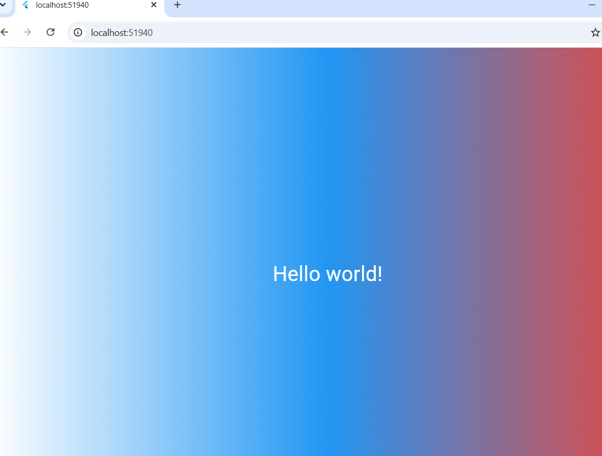

# Flutter_Lab3

Лабораторная работа №3 по Flutter - знакомство с фреймворком, виджетами и деревом виджетов.

## Автор

- Перехрест Саша
- ИСП-242

## Стек и версии

- Flutter 3.47.5
- Dart 3.13.3
- Платформа: Web (Chrome)
- IDE: VS Code

## Скриншот приложения



## Запуск

1. Клонировать репозиторий:
   ```bash
   git clone https://github.com/Alexandraa19/Flutter_Lab3.git
   